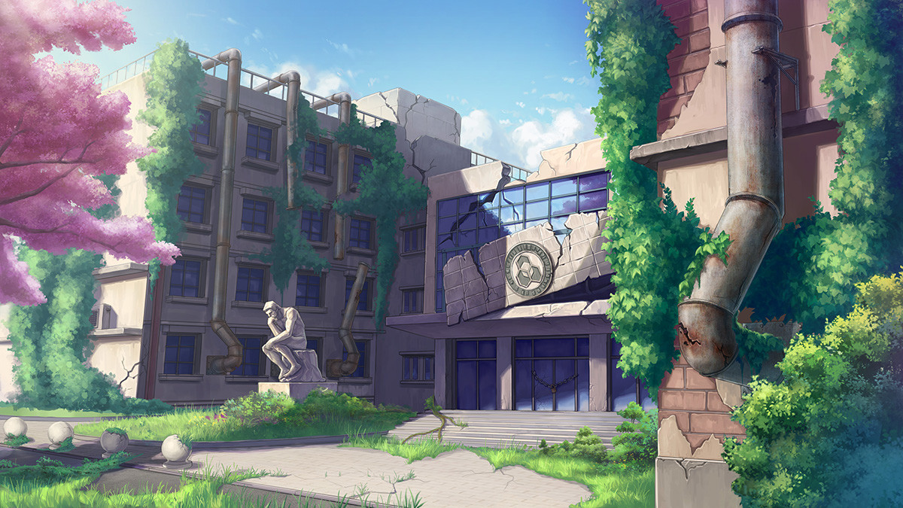
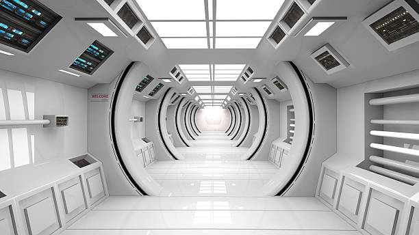

# Game Settings

{{TOC}}

## Introduction

## Setups

### Physics

### The lab

The lab looks old on the outside. Cracking and falling can be seen on the wall. Weeds around the lab building are growing thickly. Pigeons and sparrows built nests under the roof. It is not hard to notice it is a lab, but no one will know it is still running.

(It's a web image that will be replaced)

The lab is running indeed. Facilities are as good as they first run even though no one had ever maintained them. The floors are spotless even though no one had ever cleaned them.

(It's a web image that will be replaced)

The whole interior of the lab is in a loop. There is a [**reflection barrier**](#reflection_barrier) between the interior of the lab and its outside layer. Because of the reflection barrier, there is no particle exchange between the interior and the shall of the lab. The inner lab restarts periodically by periodically activating the [**space inverter**](#space_inverter).

### The Philosophy questions we want to discuss in the game
- Is mind a physics-based thing? Or more specifically, is it determined? 
	- If the mind is like a machine running inside a human body, we will do the same thing in each loop.
- 

## Rewind Settings

## Stories

### The girl in the loop

We met a girl in a deep part of the lab. She is young, pure, and energetic but lost her memory in hundreds of loops. She is just like us who think of ourselves as humans at least at the beginning.

Even though she had lost most of her memory, she still remembers her original goal. She always destroys/sacrifices herself for it. (**TODO**: come up with the goal.) Loop resets the girl's memory, so she can never remember us.

We have met her so many times on the journey and have seen her death every time. We have to find a way to change it.

### The world is changing

Even though the inside of the lab is fully isolated from the outside by the "[Reflection Barrier](#reflection_barrier)". There are still some ways to change the world.

## Terminology 

- **Reflection Barrier**: A closed barrier to isolate anything inside it from things outside it.  The barrier reflects any particles moving towards it.
- **Space Inverter**: A device can invert every particle's direction in a specific space.
- *TODO*

